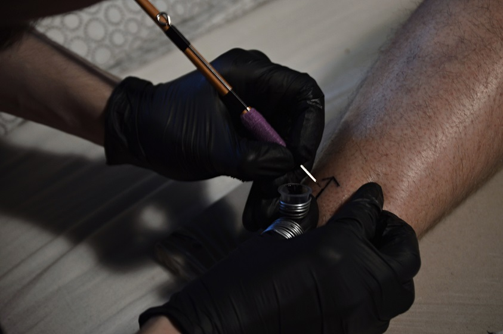
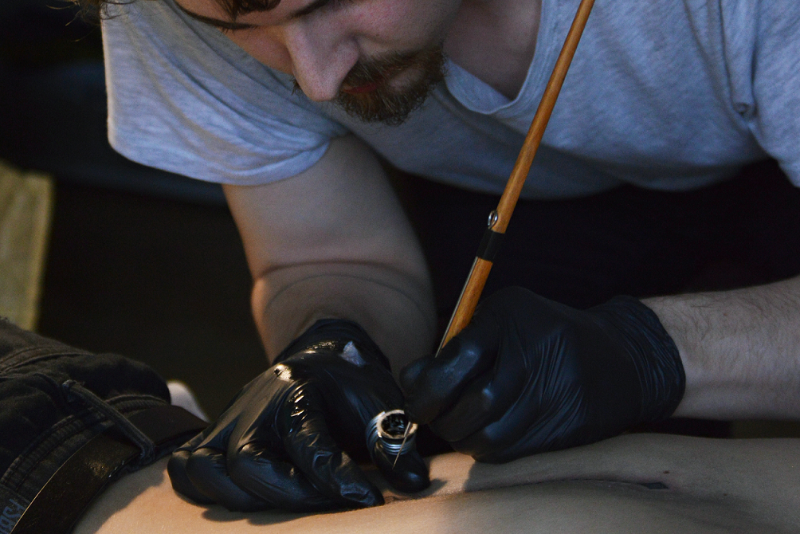
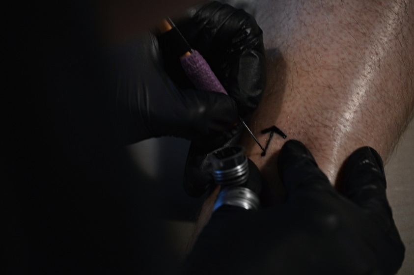
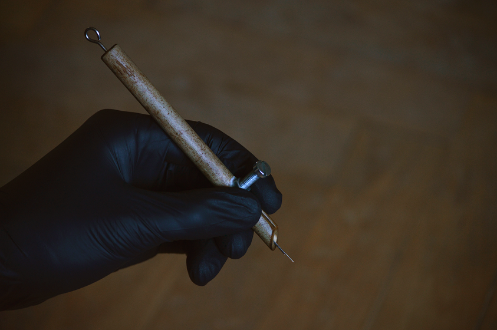
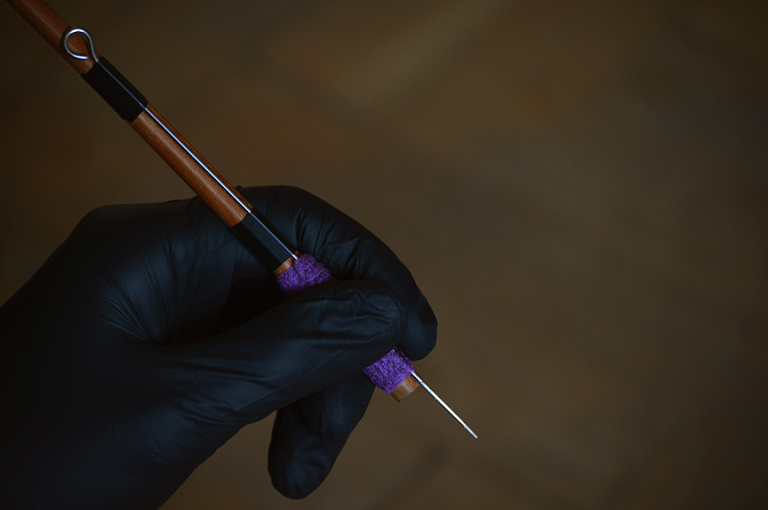
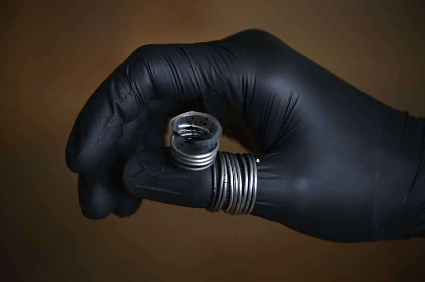
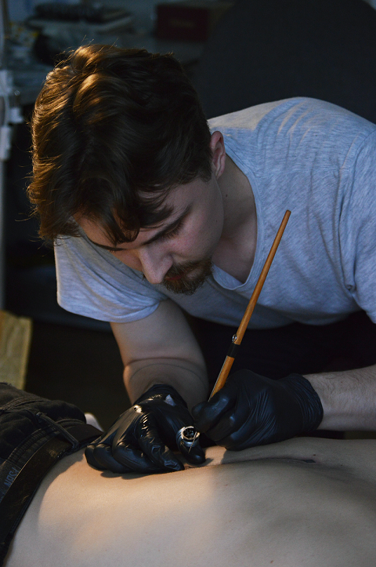

<html lang="cs">
<head>
  <meta charset="utf-8">
  <title>Handpoke Tattoo</title>
  <link rel="stylesheet" type="text/css" href="styl.css">
  
  
  
</head>
<body>
    

      <header>
         
 
		  

     <h1>Handpoke Tattoo Studio</h1>
      </header>
      
<nav>      
  

  

    <button class="dropbtn">GALERIE
      <link rel="stylesheet" href="https://cdnjs.cloudflare.com/ajax/libs/font-awesome/4.7.0/css/font-awesome.min.css">
      <i class="fa fa-caret-down"></i>
      
    </button>
    

      <a href="tattoos.html">TETOVÁNÍ</a>
      <a href="flashes.html">VOLNÉ NÁVRHY</a>
    

  

  <a href="contact.html">BOOKING</a>
  
  <a href="aboutme.html">O MĚ</a>

</nav>
   
   

                   
    <h2>CO JE HANDPOKE?</h2>
    
Handpoke, nebo také "Stick and poke" je trvalé tetování, které se tvoří bez strojku a elektřiny, pouze jehlou a barvou. Hand – ruka. Poke – šťouchnout. Je to tradiční metoda tetování, která vznikla  už před tisíci lety. Nyní se k ní mnoho lidí vrací. 

    
Výhodou této techniky je, že narozdíl od strojku nevydává žádný hluk a tatér má nad jehlou větší kontrolu. Je však pomalejší a pracnější, barva je vpravována do kůže tečku po tečce. Bolest vnímá každý jinak, ovšem pro mnohé je proces handpoku uklidňující a relaxující zkušeností, někteří jej vnímají přímo jako rituál.

    
    
    <!-- Container for the image gallery -->

  <!-- Full-width images with number text -->
  

    
1 / 6

      
  

  

    
2 / 6

      
  

  

    
3 / 6

      
  

  

    
4 / 6

      
  

  

    
5 / 6

      
  

  

    
6 / 6

      
  

  <!-- Next and previous buttons -->
  <a class="prev" onclick="plusSlides(-1)">&#10094;</a>
  <a class="next" onclick="plusSlides(1)">&#10095;</a>

  <!-- Image text -->
  

    

  

  <!-- Thumbnail images -->
  

    

      
    

    

      
    

    

      
    

    

      
    

	

      
    

    

      
    

  

  

    
    <h2>ČÍM TETUJI?</h2>
    
V současné době už samozřejmě netetujeme obroušenými kostmi nebo trny, tak jako dříve naši předkové. K tetování používám standartní jednorázové tetovací jehly a ty nejkvalitnější barvy značky 'World Famous Tattoo Ink'. Produkty, které používám, jsou veganské a netestované na zvířtech a pomůcky převážně ekologické a rozložitelné, za účelem minimalizace plastového odpadu.

    <h2>KDE TETUJI?</h2>
       
Hradec Králové. Zatím doma. Tady bude jednou adresa mého studia :) 

       <h2>PROCES STRUČNĚ KROK ZA KROKEM</h2>
       
Kontakt na mě najdete v sekci BOOKING. S klienty se nejprve domlouvám online. Napíšou jaký motiv by chtěli,jak si ho představují, nebo co by měl znázorňovat (případně mohou poslat vlastní obrázek pro inspiraci), a já jim následně zpracuji návrh ke schválení. Pokud jsou s návrhem spokojení domluvíme se na termínu kdy samotné tetování proběhne. Před tetováním by člověk neměl pít alkohol. Měl by přijít dobře naladěný a najedený. Po krátké osobní konzultaci otisknu, nebo překreslím motiv na kůži a můžeme jít na věc. Hotové tetování si vyfotím a zalepím ho fólií. Před odchodem se pak také dozvíte vše o tom, jak o své nové tetování pečovat a na co si dát pozor.

       
       <h2>Tetuji pouze osoby starší 18ti let!</h2>
       
       
        <!-- -->
        

      <footer>      
        &copy; MM, 2020
      </footer>    
    

    
    
    
 
  </body>
</html>

